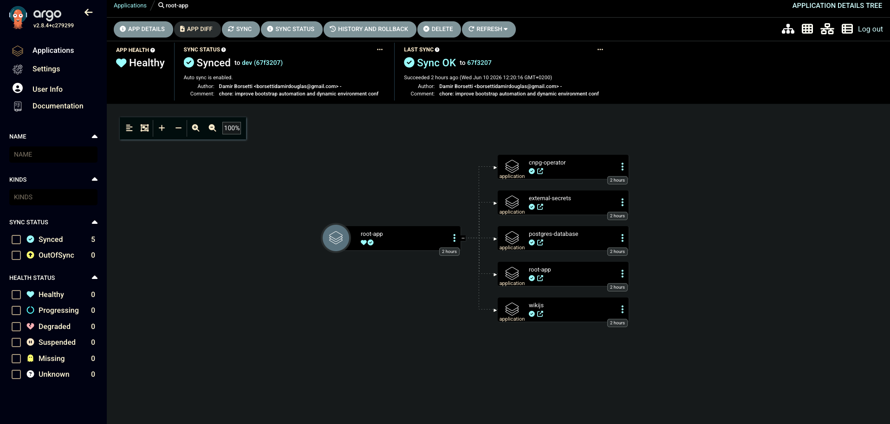
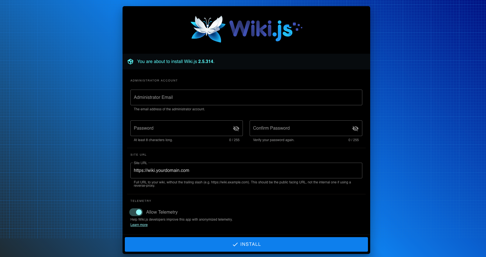

# ⚡ zenith

A production-grade Kubernetes homelab built on bare-metal VMs, mirroring enterprise GitOps patterns.


*ArgoCD "App of Apps" pattern orchestrating the entire Workload cluster.*

Two-cluster architecture: a **management cluster** running ArgoCD and Vault, and a **workload cluster** running the actual applications — fully automated from a single `make` command.

---

## 🗂 table of contents

- [stack](#-stack)
- [architecture](#-architecture)
- [prerequisites](#-prerequisites)
- [kubeconfig setup](#-kubeconfig-setup)
- [usage](#-usage)
- [verify](#-verify)
- [access the dashboards](#-access-the-dashboards)
- [teardown](#-teardown)
- [troubleshooting](#-troubleshooting)
- [design decisions](#-design-decisions)
- [roadmap](#-roadmap)

---

## 📦 stack

| component | version | cluster |
|---|---|---|
| k3s | v1.27.4 | both |
| Cilium | 1.14.3 | workload |
| Longhorn | 1.5.1 | workload |
| Traefik | 26.0.0 | workload |
| ArgoCD | 5.46.7 | management |
| Vault (HashiCorp) | 0.28.0 (chart) | management |
| External Secrets Operator | 0.9.11 | workload |
| CloudNativePG | 0.22.0 (chart) | workload |
| Wiki.js | 2.x | workload |

---

## 🏗 architecture

```
┌──────────────────────────────┐      ┌──────────────────────────────────────┐
│   management cluster         │      │   workload cluster                   │
│   zenith-mgmt-1  (4 GB RAM)  │      │   zenith-1 / 2 / 3  (3 GB RAM each) │
│                              │      │                                      │
│   ArgoCD ────────────────────────►  │  deploys all workload apps           │
│   Vault  ◄───────────────────────── │  ESO pulls secrets at runtime        │
│                              │      │                                      │
│                              │      │  Cilium  (CNI + L2 LB)               │
│                              │      │  Longhorn  (distributed storage)     │
│                              │      │  Traefik  (ingress)                  │
│                              │      │  CNPG  (Postgres HA cluster)         │
│                              │      │  Wiki.js  (application)              │
└──────────────────────────────┘      └──────────────────────────────────────┘
```

### 🔐 secrets flow

```
Operator stores credentials in Vault (once, manually)
  └── External Secrets Operator reads from Vault every 15s
        └── syncs them as Kubernetes Secrets in namespace `database`
              ├── postgres-db-secret  →  consumed by CloudNativePG
              └── wikijs-db-secret    →  consumed by Wiki.js
```

### 🔄 GitOps flow

```
Git repository  (source of truth)
  └── ArgoCD root-app  (App of Apps pattern)
        ├── external-secrets  (ESO Helm chart)
        ├── cnpg-operator     (CloudNativePG Helm chart)
        ├── postgres-database (manifests — excludes secret-store.yaml)
        └── wikijs            (manifests — excludes ingress-service.yaml)
```

> `secret-store.yaml` and `ingress-service.yaml` are excluded from ArgoCD sync and applied at bootstrap time with runtime IPs injected by the Makefile. This prevents ArgoCD's self-heal from overwriting dynamic values with Git placeholders.

---

## ✅ prerequisites

### macOS

```bash
brew install --cask multipass
brew install kubernetes-cli helm jq argocd
```

### Linux

```bash
snap install multipass
# kubectl, helm, jq, argocd: follow their official install docs
```

### recommended tools

```bash
# macOS
brew install danielfoehrkn/switch/switch
brew install kubecolor
brew install derailed/k9s/k9s
```

---

## 🔧 kubeconfig setup

The Makefile writes cluster configs to `~/.kube/clusters/`. Create the directory first:

```bash
mkdir -p ~/.kube/clusters
```

If you use `switch`, register both paths in `~/.kube/kube-switch.yaml`:

```yaml
- kind: filesystem
  id: local
  paths:
    - ~/.kube/clusters/zenith-mgmt
    - ~/.kube/clusters/zenith
```

Switch between clusters:

```bash
switch zenith-mgmt   # management cluster
switch zenith        # workload cluster
```

---

## 🚀 usage

### step 1 — management cluster

```bash
make bootstrap-mgmt
```

Creates the management VM, installs k3s, Vault, and ArgoCD.

When complete, run these **one-time manual steps**:

#### initialize and unseal Vault

```bash
switch zenith-mgmt

# Initialize — save the 5 unseal keys and root token in a password manager
kubectl exec -n vault vault-0 -- vault operator init

# Unseal — repeat 3 times with 3 different unseal keys
kubectl exec -n vault vault-0 -- vault operator unseal
```

> ⚠️ If you lose the unseal keys, Vault data is unrecoverable. Store them securely.

#### store the root token as a Kubernetes secret

```bash
kubectl create secret generic vault-root-token \
  -n vault --from-literal=token=<root-token>
```

#### enable kv-v2 and populate secrets

```bash
ROOT_TOKEN=<root-token>

# Enable the KV-V2 secrets engine
kubectl exec -n vault vault-0 -- \
  env VAULT_TOKEN=$ROOT_TOKEN vault secrets enable -path=secret kv-v2

# Store Postgres credentials (username and password — both required by CNPG)
kubectl exec -n vault vault-0 -- \
  env VAULT_TOKEN=$ROOT_TOKEN vault kv put secret/postgres-credentials \
  username=app_user \
  password=<your-password>

# Store Wiki.js database password
kubectl exec -n vault vault-0 -- \
  env VAULT_TOKEN=$ROOT_TOKEN vault kv put secret/wikijs-credentials \
  db_password=<your-password>
```

---

### step 2 — workload cluster

```bash
make bootstrap-workload
```

This single command:

1. Creates 3 workload VMs (`zenith-1`, `zenith-2`, `zenith-3`)
2. Installs k3s in HA mode with `--cluster-init`
3. Installs Cilium (CNI + L2 LoadBalancer)
4. Applies the Cilium IPAM pool with the correct runtime subnet
5. Installs Longhorn (distributed block storage)
6. Installs Traefik with the correct runtime LoadBalancer IP
7. Configures Vault Kubernetes auth for the workload cluster
8. Writes the Vault policy granting ESO read access to both secret paths
9. Removes any stale ArgoCD cluster registration and re-registers the workload cluster
10. Deploys the root-app — ArgoCD takes over from this point
11. Waits for the `database` namespace to appear, then applies `secret-store.yaml` with the runtime Vault IP
12. Waits for Traefik's LoadBalancer IP, then applies `ingress-service.yaml` with the correct `nip.io` hostname

---

## 🔍 verify

```bash
switch zenith

# All pods should be Running
kubectl get pods -A

# Watch Postgres come up (3 instances)
kubectl get pods -n database -w

# Check ExternalSecrets synced successfully
kubectl get externalsecret -n database

# Retrieve the synced Postgres password
kubectl get secret postgres-db-secret -n database \
  -o jsonpath='{.data.password}' | base64 -d

# Connect to the database directly
kubectl exec -it zenith-postgres-1 -n database -- \
  psql -U app_user -d app_db -h localhost

# Check ArgoCD application health
switch zenith-mgmt
kubectl get applications -n argocd
```

---

## 🖥 access the dashboards

### ArgoCD (management cluster)

```bash
switch zenith-mgmt

# Get the admin password
kubectl get secret argocd-initial-admin-secret -n argocd \
  -o jsonpath='{.data.password}' | base64 -d && echo

# Open a port-forward
kubectl port-forward svc/argocd-server -n argocd 8080:443
```

Open **https://localhost:8080** — username: `admin`.

---

### Wiki.js (workload cluster)

The final application running with HA Postgres and persistent storage.



```bash
switch zenith

# Get the dynamic nip.io URL
kubectl get ingress wikijs -n database \
  -o jsonpath='{.spec.rules[0].host}'
```

Open `http://wiki.<traefik-ip>.nip.io` in your browser.

> **Corporate VPN workaround:** traffic to `192.168.252.x` may be routed through the VPN tunnel instead of the local Multipass bridge. Use port-forward instead:
> ```bash
> kubectl port-forward svc/wikijs -n database 3000:3000
> # open http://localhost:3000
> ```

---

## 🧹 teardown

```bash
make destroy-workload   # destroy workload cluster only (management intact)
make destroy-mgmt       # destroy management cluster only
make destroy            # destroy everything
```

> Destroying the workload cluster does **not** affect Vault or ArgoCD on the management cluster. You can run `make bootstrap-workload` again without repeating the Vault setup.

---

## 🛠 troubleshooting

### ExternalSecret stuck in `SecretSyncedError` (403 permission denied)

Vault's Kubernetes auth role grants access only to the paths listed in `database-policy`. If a path is missing, ESO gets a 403.

Verify the current policy:

```bash
switch zenith-mgmt
ROOT_TOKEN=$(kubectl get secret vault-root-token -n vault \
  -o jsonpath='{.data.token}' | base64 -d)

kubectl exec -n vault vault-0 -- \
  env VAULT_TOKEN=$ROOT_TOKEN vault policy read database-policy
```

Expected output:

```hcl
path "secret/data/postgres-credentials" { capabilities = ["read"] }
path "secret/data/wikijs-credentials"   { capabilities = ["read"] }
```

If a path is missing, re-run `make workload-vault-auth-config`.

---

### ExternalSecret cached stale error — force a refresh

ESO caches errors between reconcile cycles. Force an immediate retry:

```bash
switch zenith
kubectl annotate externalsecret <name> -n database \
  force-sync=$(date +%s) --overwrite
```

---

### Postgres pod stuck in `Init:0/1`

The CNPG init pod waits for `postgres-db-secret` to exist. Check the ExternalSecret first:

```bash
switch zenith
kubectl get externalsecret -n database
kubectl describe externalsecret postgres-password-sync -n database
```

Once the secret syncs the pod proceeds automatically. If it stays stuck in backoff, force a restart:

```bash
kubectl delete pod -n database -l cnpg.io/cluster=zenith-postgres
```

---

### Wiki.js stuck in `Init:CreateContainerConfigError`

`wikijs-db-secret` does not exist yet. Check that `wikijs-credentials` was stored in Vault and that the ExternalSecret synced:

```bash
switch zenith
kubectl get externalsecret wikijs-secrets-sync -n database
kubectl logs -n external-secrets \
  -l app.kubernetes.io/name=external-secrets --tail=30
```

---

### Vault IP changes after VM recreation

Multipass assigns a new IP every time a VM is created. `make bootstrap-workload` handles this automatically. To fix manually without rebuilding:

```bash
switch zenith
MGMT_IP=$(multipass info zenith-mgmt-1 --format json | \
  jq -r '.info["zenith-mgmt-1"].ipv4[0]')

kubectl patch secretstore vault-backend -n database --type=merge \
  -p "{\"spec\":{\"provider\":{\"vault\":{\"server\":\"http://$MGMT_IP:30820\"}}}}"
```

---

### ArgoCD shows duplicate `zenith-workload` cluster (Unknown status)

This happens when the workload cluster is destroyed and recreated — the old IP registration persists in ArgoCD. The Makefile removes it automatically. To fix manually:

```bash
switch zenith-mgmt
argocd cluster list --port-forward --port-forward-namespace argocd
argocd cluster rm <old-server-url> \
  --port-forward --port-forward-namespace argocd --yes
```

---

### Vault sealed after management VM restart

Vault does not auto-unseal. After any reboot of `zenith-mgmt-1`:

```bash
switch zenith-mgmt
kubectl exec -n vault vault-0 -- vault operator unseal   # repeat 3x
```

---

### Makefile `missing separator` error

Make requires real TAB characters on recipe lines — not spaces. Copy-pasting from a browser often silently converts them. Check with:

```bash
cat -A Makefile | grep -n "^ "
```

Fix in your editor by enabling visible whitespace and replacing leading spaces with tabs on recipe lines.

---

## 🧠 design decisions

**Why two clusters**
Vault lives on the management cluster, which is never destroyed. The workload cluster can be torn down and rebuilt at any time without losing secrets or ArgoCD state. This cleanly separates infrastructure lifecycle from application lifecycle.

**Why Multipass instead of k3d/kind**
Longhorn requires `open-iscsi` installed on the actual node host. Container-based Kubernetes tools run nodes as Docker containers — `apt-get install open-iscsi` does not work inside them. Multipass creates real Ubuntu VMs where the full kernel module stack is available.

**Why no Sync Waves**
A hybrid approach with `initContainers` and a Makefile runtime orchestrator was chosen over ArgoCD Sync Waves for three reasons:
1. **Dynamic IPs** — ArgoCD cannot handle Multipass IPs that change on every VM recreation. The Makefile injects them at runtime.
2. **Clean Git** — dynamic manifests are excluded from ArgoCD sync to avoid polluting the repository with ephemeral IP commits.
3. **Runtime resilience** — Sync Waves only check dependencies at deploy time. The `initContainer` checks database role availability on every pod start, ensuring true self-healing across restarts.

**Why Cilium's L2 LoadBalancer instead of MetalLB**
Cilium already serves as the CNI. Using its built-in L2 announcement avoids running a second component for the same job.

**Runtime IP injection without Git commits**
`secret-store.yaml` and `traefik-values.yaml` contain placeholder IPs in Git. The Makefile resolves the real IPs at bootstrap time via `sed` and pipes the result directly to `kubectl apply` or `helm --values /dev/stdin` — never writing to disk or committing to Git. This keeps the repository portable for anyone who clones it.

**Excluding files from ArgoCD sync**
`secret-store.yaml` and `ingress-service.yaml` are excluded via `directory.exclude` in their respective ArgoCD Applications. Without this, `selfHeal: true` would immediately overwrite the runtime IP with the Git placeholder on every reconcile cycle.

**Vault cross-cluster Kubernetes auth**
Vault on the management cluster validates workload Pod identities by calling the workload cluster's API server with a long-lived `vault-token-reviewer` token. `disable_local_ca_jwt=true` is required because Vault cannot use its own cluster's JWT validation for a different cluster.

**CNPG secret format**
CloudNativePG requires a Secret containing both a `username` and a `password` key. The ExternalSecret explicitly maps both properties from the single Vault KV entry at `secret/postgres-credentials`.

**Wiki.js init container**
The Wiki.js Deployment includes an init container that waits for the `wikijs` Postgres role to exist before the main container starts. This eliminates the race condition between CNPG role creation and application startup.

---

## 🗺 roadmap

- [x] Cilium CNI + L2 LoadBalancer
- [x] Longhorn distributed storage
- [x] Traefik ingress
- [x] ArgoCD GitOps (App of Apps)
- [x] Vault secrets management
- [x] External Secrets Operator
- [x] CloudNativePG HA Postgres cluster
- [x] Wiki.js
- [ ] Monitoring (Prometheus + Grafana)
- [ ] CNPG backups to S3-compatible storage (MinIO)
